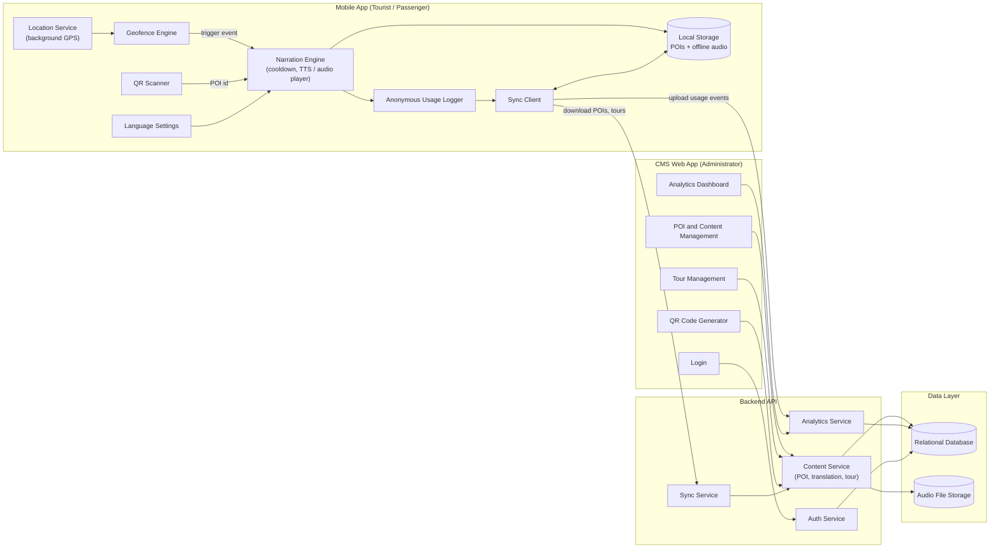
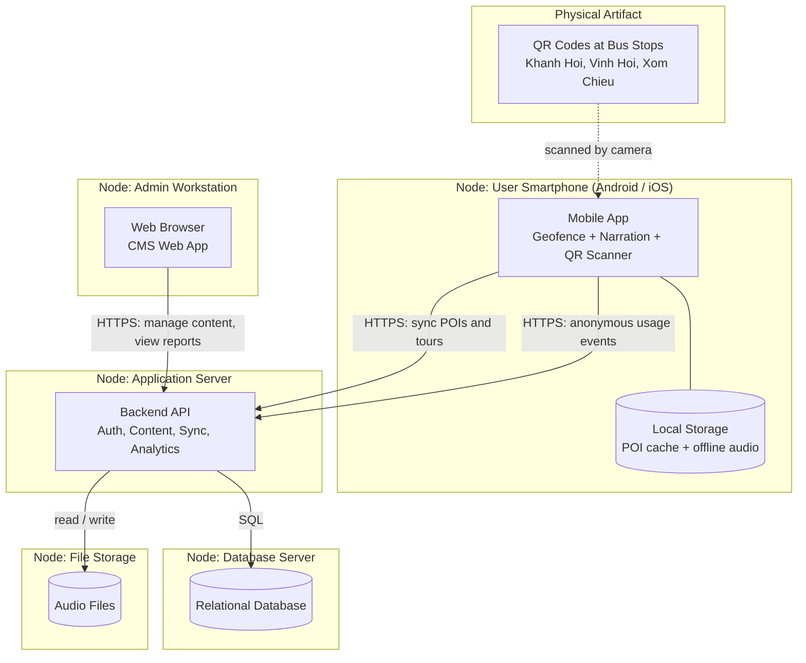
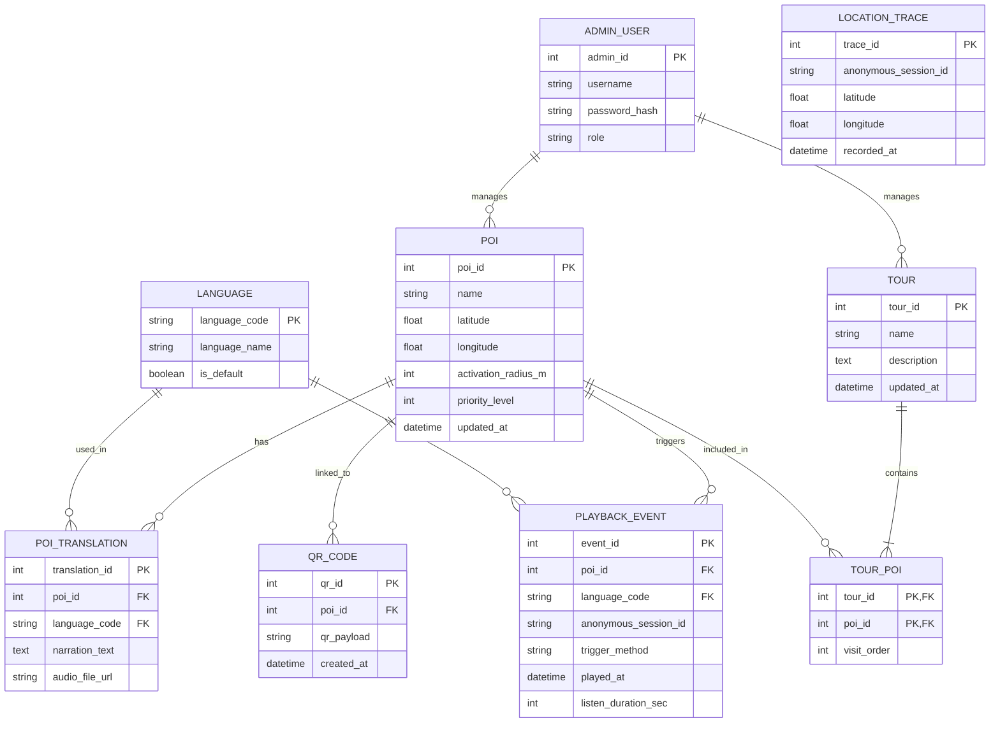

# CongNghePhanMem_Project
# Multilingual Automatic Narration System

## Component Diagram

```mermaid
flowchart LR
    subgraph MOBILE["Mobile App (Tourist / Passenger)"]
        LOC["Location Service<br/>(background GPS)"]
        GEO["Geofence Engine"]
        QR["QR Scanner"]
        NAR["Narration Engine<br/>(cooldown, TTS / audio player)"]
        LANG["Language Settings"]
        CACHE[("Local Storage<br/>POIs + offline audio")]
        SYNC["Sync Client"]
        LOG["Anonymous Usage Logger"]
    end

    subgraph CMS["CMS Web App (Administrator)"]
        AUTH_UI["Login"]
        POI_UI["POI and Content Management"]
        TOUR_UI["Tour Management"]
        QRGEN["QR Code Generator"]
        DASH["Analytics Dashboard"]
    end

    subgraph BACKEND["Backend API"]
        AUTH["Auth Service"]
        CONTENT["Content Service<br/>(POI, translation, tour)"]
        SYNCSVC["Sync Service"]
        ANALYTICS["Analytics Service"]
    end

    subgraph DATA["Data Layer"]
        DB[("Relational Database")]
        FILES[("Audio File Storage")]
    end

    LOC --> GEO
    GEO -->|trigger event| NAR
    QR -->|POI id| NAR
    LANG --> NAR
    NAR --> CACHE
    NAR --> LOG
    SYNC <--> CACHE
    LOG --> SYNC

    SYNC -->|download POIs, tours| SYNCSVC
    SYNC -->|upload usage events| ANALYTICS

    AUTH_UI --> AUTH
    POI_UI --> CONTENT
    TOUR_UI --> CONTENT
    QRGEN --> CONTENT
    DASH --> ANALYTICS

    CONTENT --> DB
    CONTENT --> FILES
    SYNCSVC --> CONTENT
    ANALYTICS --> DB
    AUTH --> DB
```

## Deployment Diagram

```mermaid
flowchart TB
    subgraph PHONE["Node: User Smartphone (Android / iOS)"]
        APP["Mobile App<br/>Geofence + Narration + QR Scanner"]
        LOCALDB[("Local Storage<br/>POI cache + offline audio")]
        APP --- LOCALDB
    end

    subgraph BROWSER["Node: Admin Workstation"]
        WEB["Web Browser<br/>CMS Web App"]
    end

    subgraph PRINT["Physical Artifact"]
        QRCODE["QR Codes at Bus Stops<br/>Khanh Hoi, Vinh Hoi, Xom Chieu"]
    end

    subgraph SERVER["Node: Application Server"]
        API["Backend API<br/>Auth, Content, Sync, Analytics"]
    end

    subgraph DBSRV["Node: Database Server"]
        DB[("Relational Database")]
    end

    subgraph STORAGE["Node: File Storage"]
        AUDIO[("Audio Files")]
    end

    QRCODE -. scanned by camera .-> APP
    APP -->|HTTPS: sync POIs and tours| API
    APP -->|HTTPS: anonymous usage events| API
    WEB -->|HTTPS: manage content, view reports| API
    API -->|SQL| DB
    API -->|read / write| AUDIO
```

## ERD

```mermaid
erDiagram
    ADMIN_USER {
        int admin_id PK
        string username
        string password_hash
        string role
    }

    LANGUAGE {
        string language_code PK
        string language_name
        boolean is_default
    }

    POI {
        int poi_id PK
        string name
        float latitude
        float longitude
        int activation_radius_m
        int priority_level
        datetime updated_at
    }

    POI_TRANSLATION {
        int translation_id PK
        int poi_id FK
        string language_code FK
        text narration_text
        string audio_file_url
    }

    QR_CODE {
        int qr_id PK
        int poi_id FK
        string qr_payload
        datetime created_at
    }

    TOUR {
        int tour_id PK
        string name
        text description
        datetime updated_at
    }

    TOUR_POI {
        int tour_id PK, FK
        int poi_id PK, FK
        int visit_order
    }

    PLAYBACK_EVENT {
        int event_id PK
        int poi_id FK
        string language_code FK
        string anonymous_session_id
        string trigger_method
        datetime played_at
        int listen_duration_sec
    }

    LOCATION_TRACE {
        int trace_id PK
        string anonymous_session_id
        float latitude
        float longitude
        datetime recorded_at
    }

    ADMIN_USER ||--o{ POI : manages
    ADMIN_USER ||--o{ TOUR : manages
    POI ||--o{ POI_TRANSLATION : has
    LANGUAGE ||--o{ POI_TRANSLATION : used_in
    POI ||--o{ QR_CODE : linked_to
    TOUR ||--|{ TOUR_POI : contains
    POI ||--o{ TOUR_POI : included_in
    POI ||--o{ PLAYBACK_EVENT : triggers
    LANGUAGE ||--o{ PLAYBACK_EVENT : played_in
```
